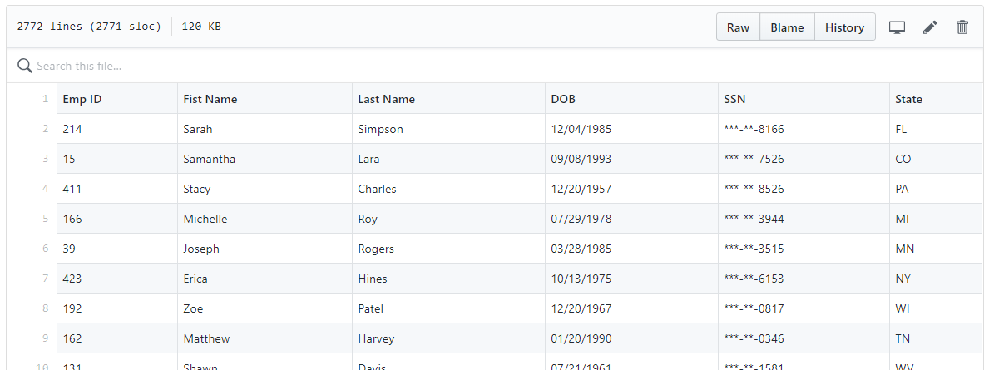

# Python Challenge

This project uses dummy data to practice using Python tools. Specifically, the two subprojects are:
- PyBank
- PyBoss

#### PyBank
Challenge using python to analyze financial records on a dummy company's revenues. Results of the analysis are shown below.

```
Financial Analysis
--------------------
Total Months: 41
Total Revenue: $18971412
Average Revenue Change: $-6758.98
Greatest Increase in Revenue: Feb-16 ($1837235)
Greatest Decrease in Revenue: Aug-14 ($-1779747)
```

```
Financial Analysis
--------------------
Total Months: 86
Total Revenue: $36973911
Average Revenue Change: $-5955.31
Greatest Increase in Revenue: Jul-2014 ($1645140)
Greatest Decrease in Revenue: Jun-2014 ($-1947745)
```

#### PyBoss
This challenge involves using python to import two csv files, reformat and export into a parsed.csv. Image showing the subset of the results is shown below:


